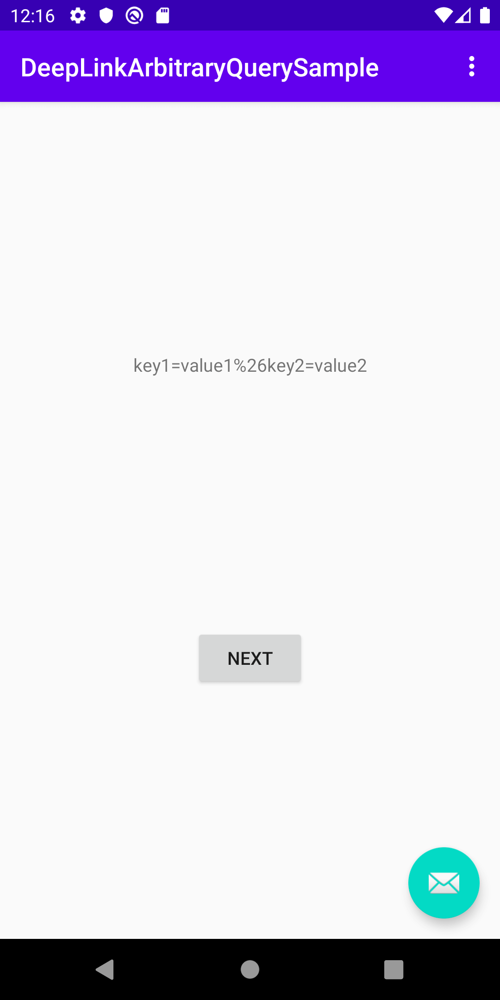

# How to test deep links
## Option 1
As per [the documentation](https://developer.android.com/training/app-links/deep-linking#testing-filters), run the following from Terminal.
```shell
adb shell am start -a android.intent.action.VIEW -d "https://example.com/?key1=value1&key2=value2"
```
Note that you have to escape `&` to `%26` to pass more than one query parameter.
### Result


## Option 2
1. Open Android Studio.
2. Go to Menu bar > `Run` > `Edit Configurations` > `General` tab > `Launch` > `URL`.
3. Put the following in `URL`.
```
https://example.com/?key1=value1&key2=value2
```
4. Run the app.
### Result


# How to take an arbitrary query string in fragments
```
The following steps are already done in this sample app.
```
1. Create a navigation graph XML like `res/navigation/nav_graph.xml`.
```xml
<navigation xmlns:app="http://schemas.android.com/apk/res-auto"
    android:id="@+id/nav_graph"
    app:startDestination="@id/FirstFragment">
    <fragment
        android:id="@+id/FirstFragment"
        android:name="com.github.tatsuyafujisaki.deeplinkarbitraryquerysample.FirstFragment" >
        <!-- The domain must ends with a trailing slash (i.e. example.com -> example.com/) to get a query string by KEY_DEEP_LINK_INTENT. -->
        <deepLink app:uri="example.com/" />
    </fragment>
</navigation>
```
2. Reference the navigation graph XML in `AndroidManifest.xml`.
```xml
<manifest xmlns:android="http://schemas.android.com/apk/res/android" ...>
    <application ...>
        <activity ...>
            <nav-graph android:value="@navigation/nav_graph" />
        </activity>
    </application>
</manifest>
```
3. Add the following in Fragment's `onCreateView()`.
```kotlin
class FirstFragment : Fragment() {
    override fun onCreateView(...): View? {
        // ...
        
        val queryString = arguments
            ?.getParcelable<Intent>(NavController.KEY_DEEP_LINK_INTENT)
            ?.data
            ?.encodedQuery

        // ...
    }
}
```
